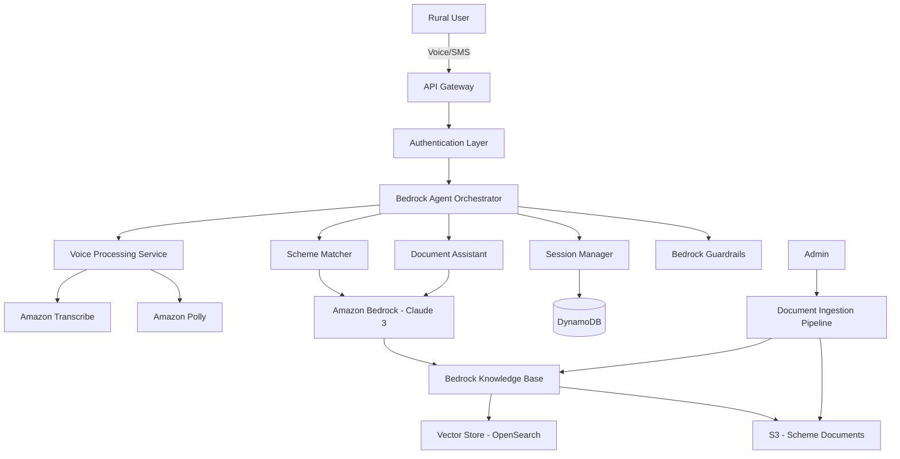

# Design Document: Bharat-Setu

## Overview

Bharat-Setu is a serverless, voice-first AI platform built on AWS that enables rural Indian citizens to discover and access government welfare schemes through natural language conversations in their regional languages. The system leverages Amazon Bedrock for AI reasoning, Amazon Transcribe and Polly for voice processing, and implements a RAG-based knowledge system to provide accurate, trustworthy information from official government sources.

The architecture follows a microservices pattern using AWS Lambda functions orchestrated through Amazon Bedrock Agents, ensuring scalability, cost-effectiveness, and high availability. The system is designed to handle millions of concurrent users while maintaining sub-3-second response times and operating effectively under poor network conditions common in rural India.

## Architecture

### High-Level Architecture



### Service Layer Architecture

The system is organized into five primary service layers:

1. **API Gateway Layer**: Handles HTTP/WebSocket connections, SMS webhooks, and request routing
2. **Orchestration Layer**: Amazon Bedrock Agents coordinate workflow between services
3. **Processing Layer**: Lambda functions for voice, session, matching, and document services
4. **Intelligence Layer**: Amazon Bedrock (Claude 3) for AI reasoning with Guardrails
5. **Data Layer**: DynamoDB for user data, S3 for documents, OpenSearch for vector embeddings

### Regional Deployment

To ensure low latency across India, the system deploys to multiple AWS regions:
- Primary: ap-south-1 (Mumbai)
- Secondary: ap-south-2 (Hyderabad)
- Failover: ap-southeast-1 (Singapore)

Each region maintains a complete copy of the knowledge base with cross-region replication for scheme documents.

## Components and Interfaces

### 1. API Gateway Service

**Responsibility**: Entry point for all user interactions, handles protocol translation and request routing.

**Interfaces**:
```typescript
interface APIGatewayService {
  // REST endpoints
  POST /voice/session/start
  POST /voice/session/message
  POST /voice/session/end
  
  // WebSocket for streaming
  WS /voice/stream
  
  // SMS webhook
  POST /sms/incoming
  
  // Health and monitoring
  GET /health
}

interface VoiceSessionRequest {
  sessionId?: string;
  language: RegionalLanguage;
  audioData?: base64String;
  textInput?: string;
}

interface VoiceSessionResponse {
  sessionId: string;
  audioResponse?: base64String;
  textResponse: string;
  schemes?: SchemeMatch[];
  documents?: DocumentChecklist;
}
```

**Implementation Notes**:
- Uses API Gateway REST API for stateless requests
- Uses API Gateway WebSocket API for streaming voice conversations
- Implements request throttling (1000 req/sec per user)
- Supports CORS for web client integration

### 2. Voice Processing Service

**Responsibility**: Converts speech to text and text to speech, handles language detection and audio optimization.

**Interfaces**:
```typescript
interface VoiceProcessingService {
  transcribe(audio: AudioBuffer, language?: RegionalLanguage): Promise<TranscriptionResult>;
  synthesize(text: string, language: RegionalLanguage): Promise<AudioBuffer>;
  detectLanguage(audio: AudioBuffer): Promise<RegionalLanguage>;
  optimizeAudio(audio: AudioBuffer, bandwidth: NetworkBandwidth): Promise<AudioBuffer>;
}

interface TranscriptionResult {
  text: string;
  confidence: number;
  detectedLanguage: RegionalLanguage;
  alternatives?: string[];
}

interface AudioBuffer {
  data: Uint8Array;
  format: 'pcm' | 'mp3' | 'opus';
  sampleRate: number;
  channels: number;
}

type RegionalLanguage = 
  | 'hi-IN'  // Hindi
  | 'ta-IN'  // Tamil
  | 'mr-IN'  // Marathi
  | 'te-IN'  // Telugu
  | 'bn-IN'  // Bengali
  | 'gu-IN'  // Gujarati
  | 'kn-IN'  // Kannada
  | 'ml-IN'  // Malayalam
  | 'pa-IN'  // Punjabi
  | 'or-IN'; // Odia
```

**Implementation Details**:
- Lambda function with 3GB memory for audio processing
- Uses Amazon Transcribe with custom vocabulary for Indian names and terms
- Uses Amazon Polly Neural voices for natural-sounding speech
- Implements audio compression for low-bandwidth scenarios (Opus codec)
- Caches common phrases to reduce Polly API calls

### 3. Session Manager Service

**Responsibility**: Manages user sessions, conversation context, and user profile storage.

**Interfaces**:
```typescript
interface SessionManagerService {
  createSession(language: RegionalLanguage): Promise<Session>;
  getSession(sessionId: string): Promise<Session>;
  updateSession(sessionId: string, updates: Partial<Session>): Promise<Session>;
  endSession(sessionId: string): Promise<void>;
  
  saveUserProfile(sessionId: string, profile: UserProfile): Promise<void>;
  getUserProfile(userId: string): Promise<UserProfile | null>;
  
  addMessage(sessionId: string, message: ConversationMessage): Promise<void>;
  getConversationHistory(sessionId: string): Promise<ConversationMessage[]>;
}

interface Session {
  sessionId: string;
  userId?: string;
  language: RegionalLanguage;
  userProfile?: UserProfile;
  conversationHistory: ConversationMessage[];
  createdAt: number;
  lastActivityAt: number;
  expiresAt: number;
}

interface UserProfile {
  age: number;
  occupation: string;
  monthlyIncome: number;
  location: {
    state: string;
    district: string;
    pincode?: string;
  };
  familySize: number;
  hasRationCard: boolean;
  hasAadhar: boolean;
}

interface ConversationMessage {
  role: 'user' | 'assistant';
  content: string;
  timestamp: number;
  metadata?: {
    audioUrl?: string;
    schemes?: string[];
    confidence?: number;
  };
}
```

**Implementation Details**:
- DynamoDB table with sessionId as partition key
- TTL set to 30 days for automatic cleanup
- User profiles encrypted at rest using AWS KMS
- Session data cached in ElastiCache for active sessions
- Implements conversation summarization after 10 exchanges to reduce context size

### 4. Scheme Matcher Service

**Responsibility**: Analyzes user profiles against scheme eligibility criteria and provides personalized recommendations.

**Interfaces**:
```typescript
interface SchemeMatcherService {
  matchSchemes(profile: UserProfile): Promise<SchemeMatch[]>;
  checkEligibility(profile: UserProfile, schemeId: string): Promise<EligibilityResult>;
  explainMatch(profile: UserProfile, schemeId: string, language: RegionalLanguage): Promise<string>;
  rankSchemes(matches: SchemeMatch[]): SchemeMatch[];
}

interface SchemeMatch {
  schemeId: string;
  schemeName: string;
  schemeNameLocal: string;
  eligibilityScore: number; // 0-100
  estimatedBenefit: {
    amount?: number;
    description: string;
  };
  matchReason: string;
  priority: 'high' | 'medium' | 'low';
}

interface EligibilityResult {
  eligible: boolean;
  confidence: number;
  reasons: string[];
  missingCriteria?: string[];
  borderlineCriteria?: string[];
}

interface SchemeDefinition {
  schemeId: string;
  name: string;
  nameTranslations: Record<RegionalLanguage, string>;
  eligibilityCriteria: EligibilityCriteria;
  benefits: BenefitDetails;
  applicationProcess: ApplicationStep[];
  requiredDocuments: string[];
  sourceDocument: string;
  lastUpdated: number;
}

interface EligibilityCriteria {
  ageRange?: { min: number; max: number };
  occupations?: string[];
  maxIncome?: number;
  minIncome?: number;
  states?: string[];
  familySizeMin?: number;
  requiredDocuments?: string[];
  customRules?: string; // Natural language rules for AI evaluation
}
```

**Implementation Details**:
- Lambda function with 2GB memory
- Uses Amazon Bedrock (Claude 3 Sonnet) for intelligent matching
- Implements prompt template for structured eligibility evaluation
- Caches scheme definitions in memory (loaded at cold start)
- Uses DynamoDB for scheme metadata with GSI on state/occupation
- Implements fuzzy matching for occupation categories

### 5. Knowledge Base Service

**Responsibility**: Provides RAG-based retrieval of information from official government scheme documents.

**Interfaces**:
```typescript
interface KnowledgeBaseService {
  query(question: string, context: QueryContext): Promise<KnowledgeResult>;
  ingestDocument(document: SchemeDocument): Promise<void>;
  updateDocument(documentId: string, document: SchemeDocument): Promise<void>;
  searchSchemes(filters: SchemeFilters): Promise<SchemeDefinition[]>;
}

interface QueryContext {
  language: RegionalLanguage;
  userProfile?: UserProfile;
  conversationHistory?: ConversationMessage[];
  schemeIds?: string[];
}

interface KnowledgeResult {
  answer: string;
  sources: DocumentSource[];
  confidence: number;
  relatedSchemes?: string[];
}

interface DocumentSource {
  documentId: string;
  documentName: string;
  excerpt: string;
  pageNumber?: number;
  lastUpdated: number;
  url?: string;
}

interface SchemeDocument {
  documentId: string;
  schemeId: string;
  title: string;
  content: string;
  language: 'en' | RegionalLanguage;
  documentType: 'guideline' | 'application_form' | 'faq' | 'notification';
  publishedDate: number;
  sourceUrl: string;
  metadata: Record<string, any>;
}
```

**Implementation Details**:
- Amazon Bedrock Knowledge Base with OpenSearch Serverless vector store
- Document chunking strategy: 1000 tokens with 200 token overlap
- Embedding model: Amazon Titan Embeddings G1 - Text
- Retrieval: Top-k=5 with minimum similarity threshold of 0.7
- S3 bucket for source documents with versioning enabled
- Lambda function for document ingestion pipeline
- Implements multilingual retrieval with translation layer

### 6. Document Assistant Service

**Responsibility**: Generates simplified, localized document checklists for scheme applications.

**Interfaces**:
```typescript
interface DocumentAssistantService {
  generateChecklist(schemeId: string, language: RegionalLanguage): Promise<DocumentChecklist>;
  explainDocument(documentType: string, language: RegionalLanguage): Promise<DocumentExplanation>;
  getObtainingGuidance(documentType: string, location: Location, language: RegionalLanguage): Promise<string>;
}

interface DocumentChecklist {
  schemeId: string;
  schemeName: string;
  documents: DocumentItem[];
  totalDocuments: number;
  estimatedTimeToGather: string;
}

interface DocumentItem {
  documentType: string;
  displayName: string;
  description: string;
  isRequired: boolean;
  alternativesAccepted?: string[];
  obtainingGuidance: string;
  estimatedCost?: number;
  estimatedTime?: string;
  priority: number;
}

interface DocumentExplanation {
  documentType: string;
  commonName: string;
  officialName: string;
  purpose: string;
  whoIssues: string;
  whereToGet: string;
  costEstimate?: number;
  timeEstimate?: string;
  requiredForSchemes: string[];
}
```

**Implementation Details**:
- Lambda function with 1GB memory
- Uses Amazon Bedrock for generating explanations in local languages
- Maintains document template database in DynamoDB
- Implements location-based guidance (different procedures by state)
- Caches common document explanations in ElastiCache

### 7. Guardrails Service

**Responsibility**: Ensures AI responses are factually accurate and prevents misinformation about government schemes.

**Interfaces**:
```typescript
interface GuardrailsService {
  validateResponse(response: string, context: ValidationContext): Promise<ValidationResult>;
  applyContentFilters(response: string): Promise<string>;
  requireCitation(claim: string): Promise<boolean>;
}

interface ValidationContext {
  query: string;
  userProfile?: UserProfile;
  schemeIds?: string[];
  sources: DocumentSource[];
}

interface ValidationResult {
  isValid: boolean;
  confidence: number;
  issues?: ValidationIssue[];
  safeAlternative?: string;
}

interface ValidationIssue {
  type: 'misinformation' | 'unsupported_claim' | 'harmful_content' | 'missing_citation';
  severity: 'high' | 'medium' | 'low';
  description: string;
  location: { start: number; end: number };
}
```

**Implementation Details**:
- Amazon Bedrock Guardrails with custom policies
- Content filters: Hate speech, profanity, PII detection
- Factual grounding: Requires citations from knowledge base
- Prompt attack detection: Prevents jailbreaking attempts
- Implements fact-checking against known scheme parameters
- Logs all blocked responses for review

### 8. Bedrock Agent Orchestrator

**Responsibility**: Coordinates workflow between services and manages conversation flow.

**Agent Configuration**:
```yaml
AgentName: BharatSetuOrchestrator
FoundationModel: anthropic.claude-3-sonnet-20240229-v1:0
Instruction: |
  You are Bharat-Setu, a helpful AI assistant that helps rural Indian citizens
  discover and access government welfare schemes. You speak in simple, 
  conversational language and always provide accurate information from official sources.
  
  Your workflow:
  1. Greet users warmly in their language
  2. Collect their profile information conversationally
  3. Match them to relevant schemes
  4. Explain eligibility in simple terms
  5. Provide document checklists when requested
  6. Always cite official sources
  7. Encourage users to verify with local authorities

ActionGroups:
  - name: VoiceProcessing
    functions: [transcribe, synthesize, detectLanguage]
  - name: SessionManagement
    functions: [createSession, updateSession, getUserProfile]
  - name: SchemeMatching
    functions: [matchSchemes, checkEligibility, explainMatch]
  - name: KnowledgeRetrieval
    functions: [query, searchSchemes]
  - name: DocumentAssistance
    functions: [generateChecklist, explainDocument]

GuardrailId: bharat-setu-guardrails-v1
GuardrailVersion: "1"
```

## Data Models

### DynamoDB Tables

#### Sessions Table
```typescript
{
  TableName: "BharatSetu-Sessions",
  KeySchema: [
    { AttributeName: "sessionId", KeyType: "HASH" }
  ],
  AttributeDefinitions: [
    { AttributeName: "sessionId", AttributeType: "S" },
    { AttributeName: "userId", AttributeType: "S" },
    { AttributeName: "expiresAt", AttributeType: "N" }
  ],
  GlobalSecondaryIndexes: [
    {
      IndexName: "UserIdIndex",
      KeySchema: [{ AttributeName: "userId", KeyType: "HASH" }]
    }
  ],
  TimeToLiveSpecification: {
    AttributeName: "expiresAt",
    Enabled: true
  },
  BillingMode: "PAY_PER_REQUEST",
  PointInTimeRecoveryEnabled: true,
  SSESpecification: { Enabled: true, SSEType: "KMS" }
}
```

#### UserProfiles Table
```typescript
{
  TableName: "BharatSetu-UserProfiles",
  KeySchema: [
    { AttributeName: "userId", KeyType: "HASH" }
  ],
  AttributeDefinitions: [
    { AttributeName: "userId", AttributeType: "S" },
    { AttributeName: "state", AttributeType: "S" },
    { AttributeName: "occupation", AttributeType: "S" }
  ],
  GlobalSecondaryIndexes: [
    {
      IndexName: "StateOccupationIndex",
      KeySchema: [
        { AttributeName: "state", KeyType: "HASH" },
        { AttributeName: "occupation", KeyType: "RANGE" }
      ]
    }
  ],
  BillingMode: "PAY_PER_REQUEST",
  PointInTimeRecoveryEnabled: true,
  SSESpecification: { Enabled: true, SSEType: "KMS" }
}
```

#### SchemeDefinitions Table
```typescript
{
  TableName: "BharatSetu-SchemeDefinitions",
  KeySchema: [
    { AttributeName: "schemeId", KeyType: "HASH" }
  ],
  AttributeDefinitions: [
    { AttributeName: "schemeId", AttributeType: "S" },
    { AttributeName: "state", AttributeType: "S" },
    { AttributeName: "category", AttributeType: "S" }
  ],
  GlobalSecondaryIndexes: [
    {
      IndexName: "StateCategoryIndex",
      KeySchema: [
        { AttributeName: "state", KeyType: "HASH" },
        { AttributeName: "category", KeyType: "RANGE" }
      ]
    }
  ],
  BillingMode: "PAY_PER_REQUEST"
}
```

### S3 Bucket Structure

```
bharat-setu-documents/
├── schemes/
│   ├── central/
│   │   ├── pm-kisan/
│   │   │   ├── guidelines-en.pdf
│   │   │   ├── guidelines-hi.pdf
│   │   │   └── application-form.pdf
│   │   └── ayushman-bharat/
│   │       └── ...
│   └── state/
│       ├── maharashtra/
│       └── tamil-nadu/
├── embeddings/
│   └── [auto-generated by Bedrock KB]
└── audio-cache/
    └── [cached Polly responses]
```

### Vector Store Schema (OpenSearch)

```json
{
  "mappings": {
    "properties": {
      "embedding": {
        "type": "knn_vector",
        "dimension": 1536
      },
      "text": { "type": "text" },
      "schemeId": { "type": "keyword" },
      "documentId": { "type": "keyword" },
      "language": { "type": "keyword" },
      "metadata": {
        "properties": {
          "pageNumber": { "type": "integer" },
          "section": { "type": "keyword" },
          "lastUpdated": { "type": "date" }
        }
      }
    }
  }
}
```


## Correctness Properties

A property is a characteristic or behavior that should hold true across all valid executions of a system—essentially, a formal statement about what the system should do. Properties serve as the bridge between human-readable specifications and machine-verifiable correctness guarantees.

### Property Reflection

After analyzing all acceptance criteria, several redundancies were identified and consolidated:

- **Voice processing properties**: Combined language-specific transcription and synthesis tests into unified multilingual properties
- **Performance properties**: Consolidated multiple latency requirements into comprehensive end-to-end timing properties
- **Storage and encryption**: Combined encryption verification with storage operations
- **Logging and metrics**: Unified various logging requirements into comprehensive audit trail properties
- **Session management**: Combined session creation, retrieval, and context properties into session lifecycle properties

### Core Functional Properties

**Property 1: Multilingual Voice Transcription**
*For any* audio input in any of the 10 supported Regional_Languages (Hindi, Tamil, Marathi, Telugu, Bengali, Gujarati, Kannada, Malayalam, Punjabi, Odia), the Voice_Interface should successfully transcribe the speech to text with the correct language detected.
**Validates: Requirements 1.1, 1.2**

**Property 2: Multilingual Speech Synthesis**
*For any* text response in any of the 10 supported Regional_Languages, the Voice_Interface should successfully synthesize natural speech audio in the correct language.
**Validates: Requirements 2.1**

**Property 3: Long Response Segmentation**
*For any* response text exceeding 500 characters, the Voice_Interface should break it into multiple segments, each under 500 characters.
**Validates: Requirements 2.3**

**Property 4: Audio Compression Under Low Bandwidth**
*For any* audio output when network bandwidth is below 100 kbps, the Voice_Interface should apply compression to reduce file size while maintaining audio format validity.
**Validates: Requirements 2.5, 11.1**

**Property 5: Language Switching Consistency**
*For any* active session, when the user switches from one Regional_Language to another, all subsequent interactions should use the new language consistently.
**Validates: Requirements 3.3**

**Property 6: User Profile Validation**
*For any* User_Profile data, the Session_Manager should reject profiles where income is negative or age is outside the range [1, 120].
**Validates: Requirements 4.4**

**Property 7: Incomplete Profile Prompting**
*For any* User_Profile submission missing required fields (age, occupation, income, location, or family size), the Session_Manager should prompt for the missing fields before proceeding.
**Validates: Requirements 4.3**

**Property 8: Profile Storage with Encryption**
*For any* complete User_Profile, when stored by the Session_Manager, the data should be encrypted and retrievable in its original form.
**Validates: Requirements 4.5, 13.1**

**Property 9: Scheme Matching Returns Results**
*For any* valid User_Profile, the Scheme_Matcher should return at least one scheme match or explicitly indicate no matches found.
**Validates: Requirements 5.1**

**Property 10: Scheme Ranking Order**
*For any* set of matched schemes, the Scheme_Matcher should return them in descending order by eligibility score.
**Validates: Requirements 5.2**

**Property 11: Eligibility Explanation Presence**
*For any* matched scheme, the Scheme_Matcher should provide a non-empty explanation of why the user is eligible.
**Validates: Requirements 5.3**

**Property 12: Binary Eligibility Response**
*For any* specific scheme eligibility query, the Scheme_Matcher should return a clear boolean (eligible/not eligible) with reasoning.
**Validates: Requirements 5.4**

**Property 13: Knowledge Base Source Attribution**
*For any* scheme-related answer from the Knowledge_Base, the response should include at least one citation to a source document with a last updated date.
**Validates: Requirements 6.1, 6.4**

**Property 14: Unknown Information Handling**
*For any* query where the Knowledge_Base cannot find information in official sources, the response should explicitly state that information is unavailable rather than speculating.
**Validates: Requirements 6.3**

**Property 15: Document Source Recency Priority**
*For any* query where multiple Scheme_Documents contain relevant information, the Knowledge_Base should prioritize excerpts from the most recently updated document.
**Validates: Requirements 6.5**

**Property 16: Document Checklist Generation**
*For any* valid scheme ID, the Document_Assistant should generate a non-empty checklist containing at least one required document.
**Validates: Requirements 7.1**

**Property 17: Localized Document Descriptions**
*For any* document in a checklist, when generated for a specific Regional_Language, all document names and descriptions should be in that language.
**Validates: Requirements 7.2**

**Property 18: Document Obtaining Guidance**
*For any* document in a checklist, the Document_Assistant should provide non-empty guidance on where to obtain it.
**Validates: Requirements 7.3, 7.5**

**Property 19: Document Checklist Ordering**
*For any* generated document checklist, documents should be ordered by priority (required documents before optional ones).
**Validates: Requirements 7.4**

**Property 20: Guardrail Validation Occurs**
*For any* AI-generated response about schemes, the Guardrail_System should validate it before delivery to the user.
**Validates: Requirements 8.1**

**Property 21: Misinformation Blocking**
*For any* response flagged as potential misinformation by the Guardrail_System, the system should block it and provide a safe alternative response.
**Validates: Requirements 8.2**

**Property 22: Citation Requirement for Uncertain Claims**
*For any* response containing factual claims about schemes, the Guardrail_System should ensure it includes citations from the Knowledge_Base.
**Validates: Requirements 8.3**

**Property 23: Eligibility Disclaimer Presence**
*For any* response about scheme eligibility, the response should include a disclaimer advising users to consult official authorities.
**Validates: Requirements 8.4**

**Property 24: Blocked Response Logging**
*For any* response blocked by the Guardrail_System, the Session_Manager should create a log entry with timestamp and reason.
**Validates: Requirements 8.5**

### Performance Properties

**Property 25: Voice Processing Initiation Latency**
*For any* completed user speech input, the Voice_Interface should begin processing within 500 milliseconds.
**Validates: Requirements 9.1**

**Property 26: End-to-End Response Latency**
*For any* user query, the total time from speech completion to audio output start should be under 3 seconds under normal network conditions.
**Validates: Requirements 9.2**

**Property 27: High Latency Acknowledgment**
*For any* request experiencing network latency above 2 seconds, the Session_Manager should provide an acknowledgment within 1 second.
**Validates: Requirements 9.3**

**Property 28: Incremental Response Streaming**
*For any* complex query requiring more than 2 seconds to process, the AI_Reasoning_Engine should stream the response incrementally rather than waiting for completion.
**Validates: Requirements 9.4**

**Property 29: Delay Notification**
*For any* request experiencing processing delays beyond expected time, the Voice_Interface should inform the user with an estimated wait time.
**Validates: Requirements 9.5**

**Property 30: Database Query Performance**
*For any* User_Profile retrieval query, the Session_Manager should return results within 100 milliseconds.
**Validates: Requirements 14.3**

**Property 31: Knowledge Base Query Performance**
*For any* batch of 100 Knowledge_Base queries, at least 95 should complete within 500 milliseconds.
**Validates: Requirements 14.4**

### Session Management Properties

**Property 32: Unique Session Identifier**
*For any* two sessions created by the Session_Manager, they should have different session IDs.
**Validates: Requirements 10.1**

**Property 33: Conversation Context Retrieval**
*For any* session with conversation history, when a user refers to previously mentioned information, the Session_Manager should retrieve relevant context from that session.
**Validates: Requirements 10.2**

**Property 34: Session Inactivity Timeout**
*For any* session inactive for more than 10 minutes, the Session_Manager should prompt the user to confirm continuation before proceeding.
**Validates: Requirements 10.3**

**Property 35: Conversation History Retention**
*For any* ended session, the Session_Manager should store the conversation history and make it retrievable for at least 30 days.
**Validates: Requirements 10.4**

**Property 36: Returning User Profile Offer**
*For any* returning user (identified by user ID) starting a new session, the Session_Manager should offer to retrieve their previously saved User_Profile.
**Validates: Requirements 10.5**

### Network Resilience Properties

**Property 37: Session State Caching on Disconnection**
*For any* active session experiencing network disconnection, the Session_Manager should cache the current conversation state locally.
**Validates: Requirements 11.2**

**Property 38: Session Resumption After Reconnection**
*For any* cached session, when network connection is restored, the Session_Manager should resume from the last successful interaction.
**Validates: Requirements 11.3**

**Property 39: High Latency User Notification**
*For any* request experiencing network latency exceeding 5 seconds, the Voice_Interface should inform the user and suggest retrying.
**Validates: Requirements 11.4**

**Property 40: Offline Mode Fallback**
*For any* query when offline capability is enabled and network is unavailable, the Voice_Interface should provide basic scheme information from cached data.
**Validates: Requirements 11.5**

### SMS Fallback Properties

**Property 41: SMS Text Input Processing**
*For any* text message received via SMS, the Voice_Interface should process it as text input equivalent to transcribed voice.
**Validates: Requirements 12.1**

**Property 42: SMS Response Length Limit**
*For any* response sent via SMS, each message should be 160 characters or fewer.
**Validates: Requirements 12.2**

**Property 43: SMS Response Splitting**
*For any* response exceeding 160 characters when sent via SMS, the Voice_Interface should split it into multiple sequential messages, each 160 characters or fewer.
**Validates: Requirements 12.3**

**Property 44: SMS Simplified Output**
*For any* scheme match result sent via SMS, the response should include a callback number for detailed information.
**Validates: Requirements 12.4**

**Property 45: SMS Condensed Checklist**
*For any* document checklist requested via SMS, the Document_Assistant should return only essential required documents (fewer items than voice/web version).
**Validates: Requirements 12.5**

### Security and Privacy Properties

**Property 46: Data Transmission Security**
*For any* data transmitted between services, the connection should use TLS 1.3 or higher.
**Validates: Requirements 13.2**

**Property 47: Data Deletion Compliance**
*For any* user data deletion request, the Session_Manager should remove all personal information within 48 hours.
**Validates: Requirements 13.3**

**Property 48: Access Audit Logging**
*For any* User_Profile data access, the Session_Manager should create a log entry with timestamp and accessor identifier.
**Validates: Requirements 13.4**

**Property 49: Conversation History Anonymization**
*For any* conversation history older than 7 days, the Session_Manager should anonymize all personally identifiable information.
**Validates: Requirements 13.5**

### Analytics and Monitoring Properties

**Property 50: Session Metrics Recording**
*For any* completed session, the Session_Manager should record session duration, language used, and schemes discussed.
**Validates: Requirements 15.1**

**Property 51: Interaction Metrics Logging**
*For any* user interaction, the Voice_Interface should log transcription accuracy metrics and response latency.
**Validates: Requirements 15.2**

**Property 52: Scheme Match Tracking**
*For any* scheme match provided by the Scheme_Matcher, the system should increment a counter for that scheme's match frequency.
**Validates: Requirements 15.3**

**Property 53: Satisfaction Feedback Prompt**
*For any* session end, the Session_Manager should prompt the user to provide satisfaction feedback on a 1-5 scale.
**Validates: Requirements 15.4**

**Property 54: Daily Analytics Report Generation**
*For any* 24-hour period, the Session_Manager should generate a report containing system performance and user engagement metrics.
**Validates: Requirements 15.5**

### Feedback and Improvement Properties

**Property 55: Response Feedback Option**
*For any* response delivered to a user, the Voice_Interface should offer an option to mark it as helpful or not helpful.
**Validates: Requirements 16.1**

**Property 56: Negative Feedback Detail Prompt**
*For any* response marked as not helpful, the Session_Manager should prompt the user for optional details about the issue.
**Validates: Requirements 16.2**

**Property 57: Feedback Storage with Context**
*For any* submitted feedback, the Session_Manager should store it along with the associated query and response.
**Validates: Requirements 16.3**

**Property 58: Negative Feedback Pattern Flagging**
*For any* query receiving negative feedback more than 5 times, the Session_Manager should flag it for human review.
**Validates: Requirements 16.4**

**Property 59: Improvement Notification**
*For any* AI_Reasoning_Engine update based on user feedback, the Session_Manager should notify users who provided that feedback.
**Validates: Requirements 16.5**

### Cost Optimization Properties

**Property 60: Frequent Request Caching**
*For any* information requested more than 10 times in an hour, the Session_Manager should cache it to reduce API calls.
**Validates: Requirements 18.3**

**Property 61: Monthly Cost Report Generation**
*For any* calendar month, the Session_Manager should generate a cost report broken down by service component.
**Validates: Requirements 18.5**

### Government Integration Properties

**Property 62: Automatic Scheme Update Ingestion**
*For any* scheme update published to government databases, the Knowledge_Base should ingest it automatically via API.
**Validates: Requirements 19.1**

**Property 63: Eligibility Criteria Update Propagation**
*For any* change to scheme eligibility criteria, the Scheme_Matcher should reflect the updated logic in subsequent matches.
**Validates: Requirements 19.3**

**Property 64: Government API Fallback**
*For any* query when government APIs are unavailable, the Knowledge_Base should serve results from the last synchronized data.
**Validates: Requirements 19.4**

**Property 65: Synchronization Retry with Backoff**
*For any* failed data synchronization attempt, the Session_Manager should retry with exponentially increasing delays (1s, 2s, 4s, 8s, etc.).
**Validates: Requirements 19.5**

### Accessibility Properties

**Property 66: Audio Description Provision**
*For any* visual element in the interface, when a user has visual impairments enabled, the Voice_Interface should provide an audio description.
**Validates: Requirements 20.2**

**Property 67: Adaptive Transcription for Speech Difficulties**
*For any* audio input with speech rate below 50% of normal speed, the Transcription_Service should adjust sensitivity and wait times accordingly.
**Validates: Requirements 20.3**

**Property 68: Adjustable Speech Rate**
*For any* audio response, the Speech_Synthesis_Service should allow users to adjust playback speed between 0.5x and 2.0x normal speed.
**Validates: Requirements 20.4**

## Error Handling

### Error Categories and Strategies

#### 1. Voice Processing Errors

**Transcription Failures**:
- **Cause**: Poor audio quality, unsupported language, excessive noise
- **Handling**: Request user to repeat input, suggest quieter environment, offer text input alternative
- **Retry Strategy**: Up to 3 attempts with increasing noise filtering
- **User Message**: "I couldn't understand that clearly. Could you please repeat in a quieter place?"

**Synthesis Failures**:
- **Cause**: Polly service unavailable, invalid text format
- **Handling**: Fall back to text-only response, queue for retry
- **Retry Strategy**: Exponential backoff (1s, 2s, 4s)
- **User Message**: "I'm having trouble with voice right now. Here's the text response: [text]"

**Language Detection Errors**:
- **Cause**: Mixed language input, unclear speech
- **Handling**: Prompt user to select language explicitly
- **User Message**: "Which language would you like to use? Please say: Hindi, Tamil, Marathi..."

#### 2. Session Management Errors

**Session Expiration**:
- **Cause**: Inactivity timeout, server restart
- **Handling**: Offer to restore from cached state, create new session
- **User Message**: "Your session expired. Would you like to continue where we left off?"

**Profile Validation Errors**:
- **Cause**: Invalid data types, out-of-range values
- **Handling**: Provide specific feedback on invalid fields, request correction
- **User Message**: "The age you provided seems incorrect. Please provide an age between 1 and 120."

**Storage Failures**:
- **Cause**: DynamoDB unavailable, encryption key issues
- **Handling**: Cache locally, retry with backoff, alert administrators
- **Fallback**: Continue session without persistence, warn user

#### 3. Scheme Matching Errors

**No Matches Found**:
- **Cause**: User profile doesn't match any scheme criteria
- **Handling**: Provide encouraging message, suggest profile review, offer general scheme information
- **User Message**: "Based on your profile, I couldn't find matching schemes right now. Let's review your information to make sure it's accurate."

**AI Reasoning Failures**:
- **Cause**: Bedrock service unavailable, timeout, rate limiting
- **Handling**: Fall back to rule-based matching, queue for retry
- **Retry Strategy**: Circuit breaker pattern (fail fast after 3 consecutive failures)
- **User Message**: "I'm having trouble analyzing schemes right now. Let me try a simpler approach."

**Eligibility Uncertainty**:
- **Cause**: Borderline criteria, missing information in scheme documents
- **Handling**: Provide honest uncertainty, suggest consulting authorities
- **User Message**: "You might be eligible for this scheme, but I'm not completely certain. I recommend checking with your local office."

#### 4. Knowledge Base Errors

**Document Not Found**:
- **Cause**: Scheme document not yet ingested, deleted scheme
- **Handling**: Inform user, provide alternative information sources
- **User Message**: "I don't have detailed information about that scheme yet. You can check the official website at [URL]."

**RAG Retrieval Failures**:
- **Cause**: OpenSearch unavailable, embedding service down
- **Handling**: Fall back to cached responses, use scheme metadata
- **Retry Strategy**: Immediate retry once, then exponential backoff
- **User Message**: "I'm having trouble accessing detailed information. Let me provide what I know from memory."

**Conflicting Information**:
- **Cause**: Multiple document versions, outdated cache
- **Handling**: Prioritize most recent, flag for human review
- **User Message**: "I found some conflicting information. I'm showing you the most recent official guidelines from [date]."

#### 5. Network and Infrastructure Errors

**High Latency**:
- **Cause**: Poor network connectivity, server load
- **Handling**: Provide acknowledgment, stream responses, suggest SMS fallback
- **User Message**: "Your connection seems slow. I'm working on your request..."

**Service Unavailability**:
- **Cause**: AWS service outage, regional failure
- **Handling**: Automatic failover to backup region, graceful degradation
- **Retry Strategy**: Circuit breaker with health checks
- **User Message**: "We're experiencing technical difficulties. Trying an alternative route..."

**Rate Limiting**:
- **Cause**: Exceeded API quotas, DDoS protection triggered
- **Handling**: Queue requests, implement backpressure, inform user
- **User Message**: "We're experiencing high demand. Your request is queued and will be processed shortly."

#### 6. Security and Guardrail Errors

**Misinformation Detected**:
- **Cause**: AI hallucination, outdated information
- **Handling**: Block response, generate safe alternative, log incident
- **User Message**: "I want to make sure I give you accurate information. Let me rephrase that based on official sources."

**PII Detection**:
- **Cause**: User shared sensitive information unnecessarily
- **Handling**: Redact from logs, warn user, continue conversation
- **User Message**: "For your privacy, please don't share sensitive information like Aadhar numbers in our conversation."

**Prompt Injection Attempts**:
- **Cause**: Malicious user input trying to manipulate AI
- **Handling**: Block request, log security event, continue safely
- **User Message**: "I can only help with government scheme information. How can I assist you with that?"

### Error Logging and Monitoring

All errors are logged with:
- Error type and severity (critical, high, medium, low)
- Timestamp and session ID
- User context (language, location, profile if available)
- Stack trace and service component
- Recovery action taken

Critical errors trigger:
- Immediate administrator alerts
- Automatic incident creation
- Failover to backup systems

## Testing Strategy

### Dual Testing Approach

The Bharat-Setu system requires both unit testing and property-based testing to ensure comprehensive coverage:

- **Unit Tests**: Verify specific examples, edge cases, and error conditions for individual components
- **Property Tests**: Verify universal properties hold across all possible inputs using randomized testing

Both approaches are complementary and necessary. Unit tests catch concrete bugs in specific scenarios, while property tests verify general correctness across the input space.

### Property-Based Testing Configuration

**Testing Library**: We will use **fast-check** for TypeScript/JavaScript Lambda functions, as it provides excellent support for property-based testing in the Node.js ecosystem.

**Configuration Requirements**:
- Minimum 100 iterations per property test (due to randomization)
- Each property test must include a comment tag referencing the design document property
- Tag format: `// Feature: bharat-setu, Property {number}: {property_text}`
- Timeout: 30 seconds per property test to accommodate AWS service calls

**Example Property Test Structure**:
```typescript
import fc from 'fast-check';

// Feature: bharat-setu, Property 6: User Profile Validation
test('rejects profiles with invalid age or income', () => {
  fc.assert(
    fc.property(
      fc.record({
        age: fc.integer(),
        occupation: fc.string(),
        monthlyIncome: fc.integer(),
        location: fc.record({
          state: fc.string(),
          district: fc.string()
        }),
        familySize: fc.nat()
      }),
      (profile) => {
        const result = validateUserProfile(profile);
        
        if (profile.age < 1 || profile.age > 120 || profile.monthlyIncome < 0) {
          expect(result.isValid).toBe(false);
        }
      }
    ),
    { numRuns: 100 }
  );
});
```

### Unit Testing Strategy

**Testing Framework**: Jest for TypeScript/JavaScript Lambda functions

**Coverage Requirements**:
- Minimum 80% code coverage for all services
- 100% coverage for critical paths (authentication, encryption, guardrails)
- Focus on edge cases and error conditions

**Unit Test Focus Areas**:
1. **Voice Processing**: Specific audio formats, language codes, error responses
2. **Session Management**: Session lifecycle, timeout scenarios, cache behavior
3. **Scheme Matching**: Specific eligibility rules, ranking algorithms, edge cases
4. **Knowledge Base**: Document parsing, citation formatting, conflict resolution
5. **Document Assistant**: Checklist generation for specific schemes, localization
6. **Guardrails**: Known misinformation patterns, PII detection, prompt injection
7. **Error Handling**: Each error category with specific failure scenarios

### Integration Testing

**API Gateway Integration**:
- Test REST endpoints with various payloads
- Test WebSocket connection lifecycle
- Test SMS webhook processing
- Test authentication and authorization

**AWS Service Integration**:
- Mock Amazon Transcribe, Polly, Bedrock for unit tests
- Use actual services in integration tests with test data
- Test failover and retry mechanisms
- Test cross-region replication

**End-to-End Testing**:
- Complete user journeys from voice input to scheme recommendation
- Multi-turn conversations with context retention
- Language switching mid-conversation
- Error recovery scenarios

### Performance Testing

**Load Testing**:
- Simulate 1000 concurrent users per region
- Measure response latency under load
- Verify auto-scaling triggers correctly
- Test database query performance

**Latency Testing**:
- Measure end-to-end response time (target: <3 seconds)
- Measure individual service latencies
- Test under various network conditions
- Verify streaming response behavior

**Stress Testing**:
- Test system behavior at 2x expected load
- Identify breaking points
- Verify graceful degradation
- Test recovery after overload

### Security Testing

**Penetration Testing**:
- Test for prompt injection vulnerabilities
- Test authentication bypass attempts
- Test data access controls
- Test encryption implementation

**Privacy Testing**:
- Verify PII is encrypted at rest
- Verify PII is redacted from logs
- Test data deletion compliance
- Test anonymization after 7 days

### Accessibility Testing

**Voice Interface Testing**:
- Test with various speech patterns and accents
- Test with slow speech and pauses
- Test noise filtering effectiveness
- Test speech rate adjustment

**Alternative Interface Testing**:
- Test text-based chat mode
- Test SMS fallback functionality
- Test high-contrast visual mode
- Test audio descriptions

### Monitoring and Observability

**Metrics to Track**:
- Request latency (p50, p95, p99)
- Error rates by service and error type
- Transcription accuracy
- Scheme match success rate
- User satisfaction scores
- Cost per request

**Alerting Thresholds**:
- Error rate > 1%: Warning
- Error rate > 5%: Critical
- Latency p95 > 5 seconds: Warning
- Latency p95 > 10 seconds: Critical
- Guardrail blocks > 10/hour: Review

**Logging Strategy**:
- Structured JSON logs with correlation IDs
- Log levels: DEBUG, INFO, WARN, ERROR, CRITICAL
- PII redaction in all logs
- Centralized logging in CloudWatch
- Log retention: 90 days

### Continuous Integration/Deployment

**CI Pipeline**:
1. Run unit tests and property tests
2. Run linting and code quality checks
3. Build Lambda deployment packages
4. Run integration tests in test environment
5. Deploy to staging environment
6. Run end-to-end tests
7. Deploy to production with canary deployment

**Deployment Strategy**:
- Blue-green deployment for zero downtime
- Canary deployment: 10% traffic for 1 hour, then 100%
- Automatic rollback on error rate increase
- Feature flags for gradual rollout

### Test Data Management

**Synthetic Data Generation**:
- Generate realistic user profiles for testing
- Generate scheme documents with known content
- Generate audio samples in all 10 languages
- Generate conversation scenarios

**Test Data Privacy**:
- Never use real user data in tests
- Anonymize any production data used for debugging
- Separate test and production databases
- Automatic cleanup of test data after 7 days
