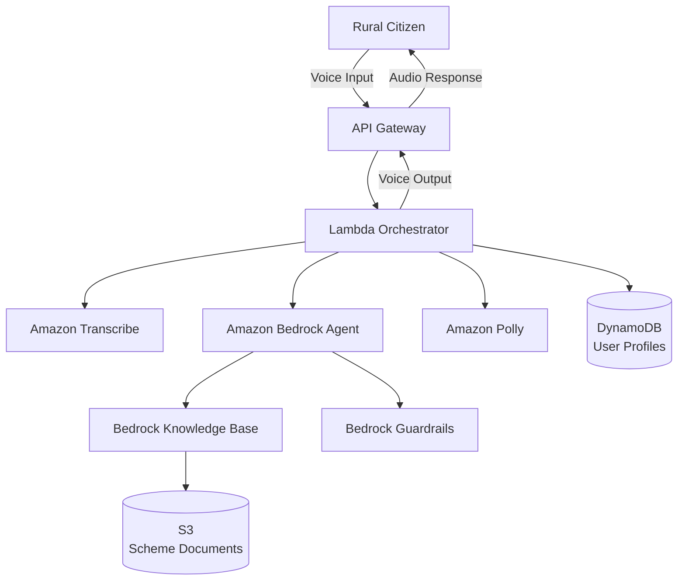

# Design Document: Bharat-Setu

## Overview

Bharat-Setu is a serverless, voice-first AI agent built on AWS that enables rural Indian citizens to discover and apply for government schemes through natural language conversations in their native languages. The system uses Amazon Bedrock for AI reasoning, Amazon Transcribe/Polly for voice processing, and implements RAG (Retrieval-Augmented Generation) for factual accuracy.

The architecture follows clean architecture principles with clear separation between:
- **Voice Layer**: Speech-to-text and text-to-speech processing
- **Intelligence Layer**: AI reasoning, scheme matching, and response generation
- **Data Layer**: User profiles, knowledge base, and document storage
- **Integration Layer**: API Gateway, orchestration, and external integrations

Key design decisions:
- **Serverless-first**: AWS Lambda for auto-scaling and cost efficiency
- **Event-driven**: Asynchronous processing where possible to minimize latency
- **RAG-based**: All factual claims grounded in official documents
- **Guardrails-enforced**: Prevent misinformation through Amazon Bedrock Guardrails
- **Streaming**: Stream audio and responses to minimize perceived latency

## Architecture

### High-Level Architecture



### Component Architecture

The system is organized into the following layers:

**1. API Layer**
- Amazon API Gateway: RESTful endpoints, authentication, rate limiting
- WebSocket API: Real-time streaming for voice interactions

**2. Orchestration Layer**
- Lambda Orchestrator: Coordinates workflow between services
- Step Functions: Manages complex multi-step interactions

**3. Voice Processing Layer**
- Transcription Service: Wraps Amazon Transcribe with language detection
- Speech Service: Wraps Amazon Polly with voice selection and caching

**4. Intelligence Layer**
- AI Agent: Amazon Bedrock Agent with Claude 3 or Llama 3
- Scheme Matcher: Analyzes user profiles against eligibility criteria
- Document Assistant: Generates checklists and guidance
- RAG System: Retrieves and ranks relevant document chunks

**5. Data Layer**
- Profile Store: DynamoDB for user profiles
- Knowledge Base: Amazon Bedrock Knowledge Base with vector embeddings
- Document Store: S3 for government scheme PDFs
- Cache Layer: ElastiCache for frequently accessed data

**6. Security Layer**
- Guardrails: Amazon Bedrock Guardrails for content filtering
- IAM: Role-based access control
- KMS: Encryption key management

### Data Flow

**Voice Query Flow:**
1. User speaks in native language
2. API Gateway receives audio stream
3. Lambda Orchestrator invokes Transcribe
4. Transcribe converts speech to text
5. Lambda retrieves user profile from DynamoDB
6. Lambda invokes Bedrock Agent with context
7. Bedrock Agent queries Knowledge Base (RAG)
8. Guardrails validate response
9. Lambda invokes Polly for text-to-speech
10. Audio response streamed back to user

**Profile Management Flow:**
1. User provides profile information via voice
2. Lambda extracts structured data from conversation
3. Profile validated and stored in DynamoDB
4. Confirmation sent to user

**Scheme Matching Flow:**
1. User asks "What schemes am I eligible for?"
2. Lambda retrieves user profile
3. Bedrock Agent reasons about eligibility
4. Knowledge Base provides scheme details
5. Results ranked by relevance
6. Response generated with explanations

## Components and Interfaces

### 1. API Gateway Interface

**Endpoints:**

```typescript
// Voice interaction endpoint
POST /v1/voice/query
Request: {
  audio: base64EncodedAudio,
  sessionId?: string,
  language?: string
}
Response: {
  audio: base64EncodedAudio,
  text: string,
  sessionId: string,
  citations?: Citation[]
}

// Profile management
POST /v1/profile
Request: {
  userId: string,
  age: number,
  occupation: string,
  income: number,
  location: string,
  language: string
}
Response: {
  profileId: string,
  status: "created" | "updated"
}

GET /v1/profile/{userId}
Response: UserProfile

// Scheme discovery
GET /v1/schemes/eligible?userId={userId}
Response: {
  schemes: Scheme[],
  explanations: string[]
}

// Document checklist
GET /v1/schemes/{schemeId}/checklist?userId={userId}
Response: {
  mandatory: Document[],
  optional: Document[],
  alternatives: DocumentAlternative[]
}
```

### 2. Lambda Orchestrator

**Responsibilities:**
- Coordinate service calls
- Manage session state
- Handle errors and retries
- Implement circuit breakers

**Interface:**

```typescript
interface Orchestrator {
  processVoiceQuery(request: VoiceQueryRequest): Promise<VoiceQueryResponse>
  createProfile(profile: UserProfile): Promise<ProfileId>
  getProfile(userId: string): Promise<UserProfile>
  matchSchemes(userId: string): Promise<SchemeMatch[]>
  generateChecklist(schemeId: string, userId: string): Promise<Checklist>
}

interface VoiceQueryRequest {
  audio: Buffer
  sessionId?: string
  userId?: string
  language?: string
}

interface VoiceQueryResponse {
  audio: Buffer
  text: string
  sessionId: string
  citations: Citation[]
  latencyMs: number
}
```

### 3. Transcription Service

**Responsibilities:**
- Convert speech to text
- Detect language automatically
- Handle audio quality issues

**Interface:**

```typescript
interface TranscriptionService {
  transcribe(audio: Buffer, language?: string): Promise<TranscriptionResult>
  detectLanguage(audio: Buffer): Promise<Language>
}

interface TranscriptionResult {
  text: string
  language: Language
  confidence: number
  durationMs: number
}

type Language = 
  | "hi-IN" // Hindi
  | "ta-IN" // Tamil
  | "mr-IN" // Marathi
  | "te-IN" // Telugu
  | "bn-IN" // Bengali
  | "gu-IN" // Gujarati
  | "kn-IN" // Kannada
  | "ml-IN" // Malayalam
  | "pa-IN" // Punjabi
  | "or-IN" // Odia
```

### 4. Speech Service

**Responsibilities:**
- Convert text to speech
- Select appropriate voice for language
- Stream audio for low latency

**Interface:**

```typescript
interface SpeechService {
  synthesize(text: string, language: Language): Promise<AudioBuffer>
  synthesizeStreaming(text: string, language: Language): AsyncIterator<AudioChunk>
  getVoiceForLanguage(language: Language): VoiceId
}

interface AudioBuffer {
  data: Buffer
  format: "mp3" | "pcm"
  sampleRate: number
}
```

### 5. AI Agent

**Responsibilities:**
- Process natural language queries
- Reason about scheme eligibility
- Generate conversational responses
- Maintain conversation context

**Interface:**

```typescript
interface AIAgent {
  processQuery(query: Query, context: ConversationContext): Promise<AgentResponse>
  matchSchemes(profile: UserProfile): Promise<SchemeMatch[]>
  generateChecklist(scheme: Scheme, profile: UserProfile): Promise<Checklist>
  explainEligibility(scheme: Scheme, profile: UserProfile): Promise<string>
}

interface Query {
  text: string
  userId?: string
  sessionId: string
  language: Language
}

interface ConversationContext {
  sessionId: string
  history: Message[]
  userProfile?: UserProfile
}

interface AgentResponse {
  text: string
  citations: Citation[]
  confidence: number
  requiresFollowUp: boolean
}
```

### 6. RAG System

**Responsibilities:**
- Retrieve relevant document chunks
- Rank results by relevance
- Provide citations

**Interface:**

```typescript
interface RAGSystem {
  query(question: string, filters?: QueryFilters): Promise<RetrievalResult[]>
  ingestDocument(document: Document): Promise<void>
  updateDocument(documentId: string, document: Document): Promise<void>
  deleteDocument(documentId: string): Promise<void>
}

interface RetrievalResult {
  text: string
  documentId: string
  documentTitle: string
  pageNumber?: number
  relevanceScore: number
  metadata: Record<string, any>
}

interface QueryFilters {
  schemeNames?: string[]
  categories?: string[]
  dateRange?: { start: Date, end: Date }
}
```

### 7. Scheme Matcher

**Responsibilities:**
- Analyze user profiles against eligibility criteria
- Rank schemes by relevance
- Explain eligibility decisions

**Interface:**

```typescript
interface SchemeMatcher {
  findEligibleSchemes(profile: UserProfile): Promise<SchemeMatch[]>
  checkEligibility(scheme: Scheme, profile: UserProfile): Promise<EligibilityResult>
  explainMatch(scheme: Scheme, profile: UserProfile): Promise<string>
}

interface SchemeMatch {
  scheme: Scheme
  eligibilityScore: number
  matchReasons: string[]
  missingCriteria?: string[]
}

interface EligibilityResult {
  isEligible: boolean
  matchedCriteria: string[]
  unmatchedCriteria: string[]
  confidence: number
}
```

### 8. Profile Store

**Responsibilities:**
- Store and retrieve user profiles
- Encrypt sensitive data
- Support profile updates

**Interface:**

```typescript
interface ProfileStore {
  create(profile: UserProfile): Promise<ProfileId>
  get(userId: string): Promise<UserProfile | null>
  update(userId: string, updates: Partial<UserProfile>): Promise<void>
  delete(userId: string): Promise<void>
}

interface UserProfile {
  userId: string
  age: number
  occupation: string
  income: number
  location: string
  language: Language
  createdAt: Date
  updatedAt: Date
}
```

### 9. Guardrails

**Responsibilities:**
- Validate AI responses
- Block misinformation
- Log interventions

**Interface:**

```typescript
interface Guardrails {
  validate(response: string, context: ValidationContext): Promise<ValidationResult>
  checkFactualAccuracy(claim: string, sources: Document[]): Promise<boolean>
}

interface ValidationContext {
  query: string
  retrievedDocuments: Document[]
  userProfile?: UserProfile
}

interface ValidationResult {
  isValid: boolean
  violations: Violation[]
  sanitizedResponse?: string
}

interface Violation {
  type: "misinformation" | "unsupported_claim" | "harmful_content"
  description: string
  severity: "low" | "medium" | "high"
}
```

## Data Models

### User Profile

```typescript
interface UserProfile {
  userId: string              // Unique identifier
  age: number                 // Age in years
  occupation: string          // e.g., "farmer", "daily_wage_worker"
  income: number              // Annual income in INR
  location: string            // District or village
  state: string               // Indian state
  language: Language          // Preferred language
  createdAt: Date
  updatedAt: Date
  metadata: {
    hasAadhaar: boolean
    hasBankAccount: boolean
    hasRationCard: boolean
  }
}
```

### Scheme

```typescript
interface Scheme {
  schemeId: string
  name: string
  nameTranslations: Record<Language, string>
  description: string
  descriptionTranslations: Record<Language, string>
  category: SchemeCategory
  eligibilityCriteria: EligibilityCriteria
  benefits: string[]
  requiredDocuments: Document[]
  applicationProcess: ApplicationStep[]
  officialUrl: string
  lastUpdated: Date
}

type SchemeCategory = 
  | "agriculture"
  | "healthcare"
  | "education"
  | "pension"
  | "housing"
  | "employment"
  | "women_empowerment"

interface EligibilityCriteria {
  minAge?: number
  maxAge?: number
  occupations?: string[]
  maxIncome?: number
  states?: string[]
  gender?: "male" | "female" | "any"
  customRules?: string[]  // Complex rules for AI to interpret
}
```

### Document

```typescript
interface Document {
  documentId: string
  name: string
  nameTranslations: Record<Language, string>
  type: DocumentType
  isMandatory: boolean
  alternatives?: Document[]
  description: string
  descriptionTranslations: Record<Language, string>
}

type DocumentType =
  | "identity_proof"
  | "address_proof"
  | "income_certificate"
  | "caste_certificate"
  | "bank_details"
  | "land_records"
  | "other"
```

### Session

```typescript
interface Session {
  sessionId: string
  userId?: string
  language: Language
  startTime: Date
  lastActivityTime: Date
  conversationHistory: Message[]
  context: Record<string, any>
  isActive: boolean
}

interface Message {
  role: "user" | "assistant"
  content: string
  timestamp: Date
  audioUrl?: string
}
```

### Citation

```typescript
interface Citation {
  documentId: string
  documentTitle: string
  pageNumber?: number
  excerpt: string
  url?: string
}
```

## Correctness Properties

*A property is a characteristic or behavior that should hold true across all valid executions of a system—essentially, a formal statement about what the system should do. Properties serve as the bridge between human-readable specifications and machine-verifiable correctness guarantees.*


### Property Reflection

After analyzing all acceptance criteria, I identified several areas of redundancy:

1. **Caching properties (16.3, 16.4)**: Both test cache behavior for similar queries. These can be combined into a single comprehensive caching property.

2. **Citation properties (5.2, 5.3)**: Both test that responses include citations. Property 5.2 (grounding claims) subsumes 5.3 (including citations), so 5.3 is redundant.

3. **Profile operations (3.1, 3.4, 3.5)**: These test different aspects of profile management but are all fundamental CRUD operations that can be tested together as profile persistence properties.

4. **Session management (13.1, 13.5, 13.6)**: These test basic session operations that are all part of session lifecycle management.

5. **Logging properties (15.1, 15.2)**: Both test that logs are created with appropriate information. These can be combined into a comprehensive logging property.

6. **Language handling (1.1, 2.1)**: Both test that the system handles multiple languages correctly in input and output respectively. These are distinct enough to keep separate.

After reflection, I've consolidated redundant properties and ensured each remaining property provides unique validation value.

### Core Properties

**Property 1: Multilingual Voice Input Acceptance**
*For any* audio input in any of the 10 supported languages (Hindi, Tamil, Marathi, Telugu, Bengali, Gujarati, Kannada, Malayalam, Punjabi, Odia), the Voice_Interface should successfully detect and accept the input.
**Validates: Requirements 1.1**

**Property 2: Language Preference Persistence**
*For any* transcription containing a language preference, the system should store that preference in the User_Profile and retrieve it correctly.
**Validates: Requirements 1.3**

**Property 3: Language Context Adaptation**
*For any* active session, when the user switches to a different supported language, all subsequent responses should be in the new language.
**Validates: Requirements 1.5**

**Property 4: Speech Synthesis Language Matching**
*For any* response text and user language preference, the Speech_Service should synthesize audio in the user's preferred language.
**Validates: Requirements 2.1**

**Property 5: Localized Number and Date Formatting**
*For any* response containing numbers or dates, the formatting should follow the conventions of the target language (e.g., Hindi uses Devanagari numerals, Tamil uses Tamil numerals).
**Validates: Requirements 2.5**

**Property 6: New User Profile Collection**
*For any* user without an existing profile, the system should initiate profile information collection during their first interaction.
**Validates: Requirements 3.1**

**Property 7: Profile Update Persistence**
*For any* existing user profile and any valid update request, the Profile_Store should persist the changes and subsequent retrievals should reflect the updated values.
**Validates: Requirements 3.4**

**Property 8: Profile Unique Identifier**
*For any* created user profile, it should have a unique identifier that can be used to retrieve that exact profile.
**Validates: Requirements 3.5**

**Property 9: Scheme Eligibility Matching**
*For any* user profile and set of schemes, the Scheme_Matcher should return only schemes where the profile satisfies all eligibility criteria.
**Validates: Requirements 4.1**

**Property 10: Scheme Relevance Ranking**
*For any* set of eligible schemes for a user, the results should be ordered by relevance score in descending order.
**Validates: Requirements 4.3**

**Property 11: Eligibility Explanation Provision**
*For any* matched scheme, the system should provide an explanation of why the user is eligible, referencing specific criteria that were met.
**Validates: Requirements 4.4**

**Property 12: Alternative Scheme Suggestions**
*For any* user profile that matches zero schemes, the system should either suggest the closest alternatives or explain what profile changes would enable eligibility.
**Validates: Requirements 4.6**

**Property 13: RAG Document Retrieval**
*For any* question about a scheme, the RAG_System should retrieve at least one relevant document chunk from the Knowledge_Base if information exists.
**Validates: Requirements 5.1**

**Property 14: Response Grounding in Sources**
*For any* AI-generated response containing factual claims, all claims should be supported by citations to retrieved documents.
**Validates: Requirements 5.2, 5.3**

**Property 15: Guardrail Blocking of Unsupported Claims**
*For any* AI response containing information not present in the Knowledge_Base, the Guardrails should block or sanitize the response.
**Validates: Requirements 5.4**

**Property 16: Acknowledgment of Knowledge Gaps**
*For any* query where the Knowledge_Base lacks sufficient information, the system should explicitly acknowledge the limitation rather than generate unsupported information.
**Validates: Requirements 5.5**

**Property 17: Document Checklist Generation**
*For any* scheme, the Document_Assistant should generate a checklist containing all required documents for that scheme.
**Validates: Requirements 6.1**

**Property 18: Checklist Language Localization**
*For any* generated checklist and user language preference, all document names and descriptions should be presented in the user's language.
**Validates: Requirements 6.2**

**Property 19: Document Alternative Explanation**
*For any* document in a checklist that has alternatives (e.g., "Aadhaar OR Voter ID"), the system should clearly list all acceptable alternatives.
**Validates: Requirements 6.3**

**Property 20: Document Priority Organization**
*For any* generated checklist, mandatory documents should be clearly separated from optional documents.
**Validates: Requirements 6.4**

**Property 21: Document Alternative Suggestions**
*For any* user profile indicating potential lack of a required document, the system should suggest alternatives or workarounds based on the scheme's accepted documents.
**Validates: Requirements 6.5**

**Property 22: Step-by-Step Guidance Provision**
*For any* scheme application request, the system should provide a sequence of actionable steps in conversational language.
**Validates: Requirements 7.1**

**Property 23: Location Detail Inclusion**
*For any* application step that involves visiting a website or office, the response should include specific URLs or physical addresses.
**Validates: Requirements 7.3**

**Property 24: Location-Specific Guidance**
*For any* scheme with location-specific application processes, the guidance should match the user's location from their profile.
**Validates: Requirements 7.5**

**Property 25: Circuit Breaker Activation**
*For any* downstream service experiencing repeated failures, the circuit breaker should open after a defined threshold and prevent further calls until recovery.
**Validates: Requirements 9.5**

**Property 26: PII Protection in Logs**
*For any* log entry, personally identifiable information (names, phone numbers, addresses, Aadhaar numbers) should not appear in plain text.
**Validates: Requirements 10.3**

**Property 27: Profile Deletion Completeness**
*For any* user profile deletion request, all associated data (profile, session history, cached data) should be removed from all storage systems.
**Validates: Requirements 10.4**

**Property 28: Role-Based Access Control**
*For any* administrative function, only requests with authorized roles should be permitted; unauthorized requests should be rejected with appropriate error codes.
**Validates: Requirements 10.5**

**Property 29: Suspicious Pattern Alert Triggering**
*For any* access pattern matching defined suspicious criteria (e.g., rapid repeated failures, unusual geographic access), a security alert should be triggered.
**Validates: Requirements 10.6**

**Property 30: Contradiction Blocking**
*For any* AI response that contradicts information in official government documents, the Guardrails should block the response.
**Validates: Requirements 11.1**

**Property 31: Uncertainty Expression**
*For any* AI response with confidence below a defined threshold, the system should explicitly express uncertainty using phrases like "I'm not certain" or "Based on available information."
**Validates: Requirements 11.2**

**Property 32: Eligibility Criteria Source Validation**
*For any* eligibility criteria mentioned in a response, it should exist verbatim or semantically equivalent in the source documents.
**Validates: Requirements 11.3**

**Property 33: Legal Query Redirection**
*For any* query classified as requiring legal interpretation, the response should include direction to official government channels or legal advisors.
**Validates: Requirements 11.4**

**Property 34: Guardrail Intervention Logging**
*For any* guardrail intervention (blocking, sanitizing, or flagging content), a detailed log entry should be created with the intervention type, reason, and original content.
**Validates: Requirements 11.5**

**Property 35: Document Version Currency**
*For any* document updated in the Knowledge_Base, all subsequent RAG queries should retrieve only the latest version, not outdated versions.
**Validates: Requirements 12.2**

**Property 36: Document Version History**
*For any* document ingestion or update, a version history entry should be created with timestamp, version number, and change metadata.
**Validates: Requirements 12.3**

**Property 37: Removed Document Exclusion**
*For any* document removed from the Knowledge_Base, it should not appear in any subsequent query results.
**Validates: Requirements 12.4**

**Property 38: Batch Document Upload**
*For any* batch of documents uploaded together, either all should be successfully ingested or none should be (atomic batch operation).
**Validates: Requirements 12.5**

**Property 39: Ingestion Failure Logging**
*For any* document ingestion failure, a log entry should be created with error details, document metadata, and an administrator alert should be triggered.
**Validates: Requirements 12.6**

**Property 40: Session Creation with Unique ID**
*For any* new user interaction, a session should be created with a globally unique identifier that doesn't collide with existing sessions.
**Validates: Requirements 13.1**

**Property 41: Conversation Context Utilization**
*For any* follow-up question within an active session, the AI_Agent should have access to and utilize previous messages in the conversation history.
**Validates: Requirements 13.3**

**Property 42: Session Termination**
*For any* active session, an explicit end-session request should immediately terminate the session and clear its context.
**Validates: Requirements 13.5**

**Property 43: Session History Storage**
*For any* active session, all messages (user and assistant) should be stored in the session's conversation history and be retrievable.
**Validates: Requirements 13.6**

**Property 44: API Authentication Validation**
*For any* API request, the authentication token should be validated, and requests with invalid or missing tokens should be rejected with HTTP 401.
**Validates: Requirements 14.2**

**Property 45: Rate Limit Enforcement**
*For any* API client exceeding defined rate limits, subsequent requests should return HTTP 429 with a Retry-After header indicating when to retry.
**Validates: Requirements 14.4**

**Property 46: Structured Error Responses**
*For any* API error, the response should be a structured JSON object containing an error code, human-readable message, and actionable guidance.
**Validates: Requirements 14.6**

**Property 47: Request Logging Completeness**
*For any* API request, a log entry should be created containing at minimum: timestamp, user ID (if authenticated), endpoint, response time, and status code.
**Validates: Requirements 15.1**

**Property 48: Error Logging with Context**
*For any* error or exception, the log entry should include the stack trace, request context, user ID, and relevant state information.
**Validates: Requirements 15.2**

**Property 49: Metrics Emission**
*For any* request processed, metrics should be emitted to CloudWatch including latency, success/failure status, and endpoint identifier.
**Validates: Requirements 15.3**

**Property 50: Error Rate Alert Triggering**
*For any* time window where error rate exceeds defined thresholds (e.g., >5% errors over 5 minutes), an automated alert should be triggered.
**Validates: Requirements 15.4**

**Property 51: Performance Degradation Tracing**
*For any* request with latency exceeding defined thresholds, a detailed trace should be captured showing time spent in each component.
**Validates: Requirements 15.6**

**Property 52: Query Response Caching**
*For any* identical query received within the cache TTL window, the system should serve the cached response without invoking Bedrock again.
**Validates: Requirements 16.3, 16.4**

**Property 53: Cost Reporting**
*For any* reporting period, the system should generate a cost breakdown showing spending by AWS service (Lambda, Bedrock, Transcribe, Polly, S3, DynamoDB).
**Validates: Requirements 16.6**

**Property 54: Unavailability Notification**
*For any* system unavailability event, the Voice_Interface should inform the user in their preferred language with a message explaining the situation.
**Validates: Requirements 17.2**

**Property 55: Session Resumption After Reconnection**
*For any* session interrupted by connectivity loss, if the user reconnects within the session timeout period, the session should resume with full context preserved.
**Validates: Requirements 17.4**

**Property 56: Critical Operation Queueing**
*For any* critical operation (profile updates, scheme applications) attempted during connectivity issues, the operation should be queued for retry rather than immediately failing.
**Validates: Requirements 17.5**

**Property 57: Verbal Option Numbering**
*For any* response presenting multiple options to the user, each option should be clearly numbered (e.g., "Option 1", "Option 2") in the verbal response.
**Validates: Requirements 18.2**

**Property 58: Technical Term Explanation**
*For any* technical term or jargon used in a response, a simple explanation should be provided either inline or immediately following the term.
**Validates: Requirements 18.4**


## Error Handling

### Error Categories

**1. Voice Processing Errors**
- **Low Audio Quality**: When transcription confidence is below threshold, request user to repeat
- **Unsupported Language**: Inform user of supported languages and request language selection
- **Transcription Timeout**: Fallback to text input option or retry with shorter audio segments
- **Speech Synthesis Failure**: Return text response with apology and retry mechanism

**2. AI Agent Errors**
- **Knowledge Base Unavailable**: Use cached responses if available, otherwise inform user of temporary unavailability
- **Guardrail Violations**: Sanitize response or provide generic safe response
- **Low Confidence Responses**: Explicitly express uncertainty and suggest contacting official channels
- **Context Window Exceeded**: Summarize conversation history and continue with condensed context

**3. Data Layer Errors**
- **Profile Not Found**: Treat as new user and initiate profile collection
- **DynamoDB Throttling**: Implement exponential backoff with jitter, queue requests if necessary
- **S3 Access Errors**: Retry with exponential backoff, fallback to cached documents
- **Data Validation Failures**: Return structured error with specific field-level validation messages

**4. Integration Errors**
- **Bedrock API Errors**: Implement circuit breaker, fallback to cached responses or simpler models
- **Transcribe/Polly Timeouts**: Retry with shorter segments, implement streaming fallbacks
- **Rate Limit Exceeded**: Queue requests, inform user of wait time
- **Network Failures**: Detect quickly, inform user, queue critical operations

**5. Security Errors**
- **Authentication Failures**: Return HTTP 401 with clear error message
- **Authorization Failures**: Return HTTP 403 with explanation of required permissions
- **Suspicious Activity Detected**: Trigger alerts, potentially rate-limit or block user
- **PII Leakage Detected**: Sanitize immediately, log incident, alert security team

### Error Handling Patterns

**Circuit Breaker Pattern**
```typescript
interface CircuitBreaker {
  state: "closed" | "open" | "half-open"
  failureThreshold: number
  successThreshold: number
  timeout: number
  
  execute<T>(operation: () => Promise<T>): Promise<T>
  recordSuccess(): void
  recordFailure(): void
  reset(): void
}
```

**Retry with Exponential Backoff**
```typescript
interface RetryConfig {
  maxAttempts: number
  initialDelayMs: number
  maxDelayMs: number
  backoffMultiplier: number
  jitter: boolean
}

async function retryWithBackoff<T>(
  operation: () => Promise<T>,
  config: RetryConfig
): Promise<T>
```

**Graceful Degradation**
- Primary: Full AI-powered response with RAG
- Fallback 1: Cached response if query is similar to recent queries
- Fallback 2: Template-based response with scheme information
- Fallback 3: Error message with contact information for human assistance

### Error Response Format

```typescript
interface ErrorResponse {
  error: {
    code: string              // Machine-readable error code
    message: string           // Human-readable message in user's language
    details?: any            // Additional context
    retryable: boolean       // Whether client should retry
    retryAfter?: number      // Seconds to wait before retry
    supportContact?: string  // Contact info for assistance
  }
  requestId: string          // For tracking and debugging
  timestamp: string
}
```

### Logging and Monitoring

**Log Levels**
- **ERROR**: System failures, unhandled exceptions, data corruption
- **WARN**: Degraded performance, fallback activations, guardrail interventions
- **INFO**: Request/response logs, profile updates, document ingestions
- **DEBUG**: Detailed execution traces, AI reasoning steps

**Structured Logging Format**
```typescript
interface LogEntry {
  timestamp: string
  level: "ERROR" | "WARN" | "INFO" | "DEBUG"
  requestId: string
  userId?: string
  sessionId?: string
  component: string
  message: string
  metadata?: Record<string, any>
  error?: {
    name: string
    message: string
    stack: string
  }
}
```

**Metrics to Track**
- Request latency (p50, p95, p99)
- Error rates by endpoint and error type
- Transcription accuracy and confidence scores
- AI response confidence scores
- Guardrail intervention rates
- Cache hit rates
- DynamoDB and S3 operation latencies
- Bedrock API call counts and costs
- Concurrent user count
- Session duration statistics

**Alerts**
- Error rate > 5% over 5-minute window
- p95 latency > 5 seconds
- Guardrail intervention rate > 10%
- DynamoDB throttling events
- Circuit breaker open state
- Cost exceeding budget thresholds
- Security incidents (suspicious patterns, PII leakage)

## Testing Strategy

### Overview

Bharat-Setu requires a comprehensive testing approach combining unit tests, property-based tests, integration tests, and end-to-end tests. Given the AI-powered nature of the system, testing focuses on:

1. **Deterministic Components**: Traditional unit and property tests
2. **AI Components**: Property tests with guardrails, example-based tests for quality
3. **Integration Points**: Contract tests and integration tests
4. **Voice Processing**: Audio sample-based tests with multiple languages
5. **Performance**: Load tests and latency benchmarks

### Testing Layers

**1. Unit Tests**
- Test individual functions and classes in isolation
- Mock external dependencies (AWS services, databases)
- Focus on edge cases, error conditions, and boundary values
- Fast execution (<1ms per test)

**2. Property-Based Tests**
- Test universal properties across randomized inputs
- Minimum 100 iterations per property test
- Each test references its design document property
- Tag format: `Feature: bharat-setu, Property {N}: {property_text}`

**3. Integration Tests**
- Test interactions between components
- Use LocalStack or AWS SAM Local for AWS service mocking
- Test actual API contracts with external services
- Verify data flow through multiple layers

**4. End-to-End Tests**
- Test complete user journeys from voice input to voice output
- Use recorded audio samples in all 10 supported languages
- Verify correctness of scheme matching and guidance
- Test session management and context preservation

**5. Performance Tests**
- Load testing with 10,000+ concurrent users
- Latency benchmarks for each component
- Stress testing to identify breaking points
- Cost analysis under various load patterns

### Property-Based Testing Configuration

**Testing Framework**: Use fast-check (TypeScript/JavaScript) or Hypothesis (Python) depending on implementation language

**Configuration**:
```typescript
// Example configuration for fast-check
const propertyTestConfig = {
  numRuns: 100,              // Minimum iterations
  timeout: 5000,             // 5 seconds per property
  verbose: true,             // Show detailed output
  seed: Date.now(),          // Reproducible randomness
  endOnFailure: false        // Run all iterations
}
```

**Generators**:
- **User Profiles**: Random age (18-100), occupation from enum, income (0-10M INR), location from Indian districts
- **Audio Samples**: Synthetic audio in each supported language
- **Schemes**: Random eligibility criteria, document requirements
- **Queries**: Natural language questions in multiple languages
- **Sessions**: Random conversation histories with varying lengths

**Property Test Examples**:

```typescript
// Property 9: Scheme Eligibility Matching
test("Feature: bharat-setu, Property 9: For any user profile and set of schemes, only eligible schemes are returned", () => {
  fc.assert(
    fc.property(
      fc.record({
        age: fc.integer({ min: 18, max: 100 }),
        occupation: fc.constantFrom("farmer", "daily_wage_worker", "self_employed"),
        income: fc.integer({ min: 0, max: 10000000 }),
        location: fc.constantFrom("rural", "urban"),
        state: fc.constantFrom("Maharashtra", "Tamil Nadu", "Karnataka")
      }),
      fc.array(generateScheme()),
      async (profile, schemes) => {
        const matcher = new SchemeMatcher(schemes)
        const matches = await matcher.findEligibleSchemes(profile)
        
        // All returned schemes must satisfy eligibility
        for (const match of matches) {
          const isEligible = checkEligibility(match.scheme, profile)
          expect(isEligible).toBe(true)
        }
        
        // No eligible schemes should be missing
        const allEligible = schemes.filter(s => checkEligibility(s, profile))
        expect(matches.length).toBe(allEligible.length)
      }
    ),
    propertyTestConfig
  )
})

// Property 14: Response Grounding in Sources
test("Feature: bharat-setu, Property 14: All factual claims have citations", () => {
  fc.assert(
    fc.property(
      fc.string({ minLength: 10, maxLength: 200 }),
      fc.array(generateDocument(), { minLength: 1, maxLength: 10 }),
      async (query, documents) => {
        const ragSystem = new RAGSystem(documents)
        const agent = new AIAgent(ragSystem)
        const response = await agent.processQuery({ text: query, sessionId: "test" })
        
        // Extract factual claims (simplified)
        const claims = extractClaims(response.text)
        
        // Each claim should have a supporting citation
        for (const claim of claims) {
          const hasCitation = response.citations.some(c => 
            c.excerpt.includes(claim) || semanticallySimilar(c.excerpt, claim)
          )
          expect(hasCitation).toBe(true)
        }
      }
    ),
    propertyTestConfig
  )
})

// Property 40: Session Creation with Unique ID
test("Feature: bharat-setu, Property 40: All sessions have unique IDs", () => {
  fc.assert(
    fc.property(
      fc.array(fc.record({ userId: fc.string() }), { minLength: 100, maxLength: 1000 }),
      async (requests) => {
        const sessionManager = new SessionManager()
        const sessionIds = new Set<string>()
        
        for (const req of requests) {
          const session = await sessionManager.createSession(req.userId)
          
          // No duplicate session IDs
          expect(sessionIds.has(session.sessionId)).toBe(false)
          sessionIds.add(session.sessionId)
        }
      }
    ),
    propertyTestConfig
  )
})
```

### Unit Test Examples

**Edge Cases**:
```typescript
// Test audio quality threshold
test("Low confidence transcription triggers repeat request", async () => {
  const lowQualityAudio = generateLowQualityAudio()
  const transcriber = new TranscriptionService()
  
  const result = await transcriber.transcribe(lowQualityAudio)
  
  expect(result.confidence).toBeLessThan(0.7)
  expect(result.requiresRepeat).toBe(true)
})

// Test session timeout
test("Session expires after 30 minutes of inactivity", async () => {
  const sessionManager = new SessionManager()
  const session = await sessionManager.createSession("user123")
  
  // Simulate 30 minutes passing
  jest.advanceTimersByTime(30 * 60 * 1000)
  
  const isActive = await sessionManager.isSessionActive(session.sessionId)
  expect(isActive).toBe(false)
})

// Test rate limiting
test("API returns 429 when rate limit exceeded", async () => {
  const apiGateway = new APIGateway()
  const userId = "user123"
  
  // Make requests up to limit
  for (let i = 0; i < 100; i++) {
    await apiGateway.handleRequest({ userId, endpoint: "/v1/voice/query" })
  }
  
  // Next request should be rate limited
  const response = await apiGateway.handleRequest({ userId, endpoint: "/v1/voice/query" })
  expect(response.statusCode).toBe(429)
  expect(response.headers["Retry-After"]).toBeDefined()
})
```

### Integration Test Examples

```typescript
// Test voice-to-voice flow
test("Complete voice query flow in Hindi", async () => {
  const hindiAudio = loadAudioSample("hindi_query.mp3")
  const orchestrator = new Orchestrator()
  
  const response = await orchestrator.processVoiceQuery({
    audio: hindiAudio,
    language: "hi-IN"
  })
  
  expect(response.audio).toBeDefined()
  expect(response.text).toContain("योजना") // "scheme" in Hindi
  expect(response.citations.length).toBeGreaterThan(0)
  expect(response.latencyMs).toBeLessThan(3000)
})

// Test RAG with actual documents
test("RAG retrieves correct scheme information", async () => {
  const knowledgeBase = await setupKnowledgeBase([
    "pm-kisan-guidelines.pdf",
    "ayushman-bharat-guidelines.pdf"
  ])
  
  const ragSystem = new RAGSystem(knowledgeBase)
  const results = await ragSystem.query("What is the income limit for PM-Kisan?")
  
  expect(results.length).toBeGreaterThan(0)
  expect(results[0].text).toContain("income")
  expect(results[0].documentTitle).toContain("PM-Kisan")
})
```

### Test Coverage Goals

- **Unit Test Coverage**: >80% line coverage for business logic
- **Property Test Coverage**: 100% of correctness properties implemented
- **Integration Test Coverage**: All API endpoints and service integrations
- **E2E Test Coverage**: Critical user journeys in all 10 languages
- **Performance Test Coverage**: All latency-sensitive operations

### Continuous Testing

**Pre-commit**:
- Run unit tests
- Run linting and type checking
- Run fast property tests (10 iterations)

**CI Pipeline**:
- Run full unit test suite
- Run full property test suite (100 iterations)
- Run integration tests
- Generate coverage reports
- Run security scans

**Staging Environment**:
- Run E2E tests with real AWS services
- Run performance benchmarks
- Run load tests with synthetic traffic
- Validate guardrails with adversarial inputs

**Production Monitoring**:
- Synthetic monitoring with canary requests
- Real user monitoring (RUM)
- Error rate tracking
- Latency monitoring
- Cost tracking

### Test Data Management

**Synthetic Data**:
- Generate user profiles covering all demographics
- Create scheme definitions for all major government programs
- Generate audio samples in all supported languages
- Create conversation scenarios for various user intents

**Real Data** (Anonymized):
- Use anonymized production logs for regression testing
- Collect real audio samples (with consent) for quality testing
- Use actual government PDFs for RAG testing

**Test Data Refresh**:
- Update scheme information monthly
- Refresh audio samples quarterly
- Regenerate synthetic data for each test run

### Testing AI Components

**Guardrail Testing**:
- Test with adversarial prompts attempting to bypass guardrails
- Verify blocking of misinformation
- Test with edge cases (ambiguous queries, contradictory information)
- Measure false positive rate (legitimate queries blocked)

**RAG Quality Testing**:
- Measure retrieval precision and recall
- Test with queries requiring multi-document reasoning
- Verify citation accuracy
- Test with outdated vs. current documents

**Response Quality Testing**:
- Human evaluation of response quality (sample-based)
- Measure response relevance using automated metrics
- Test language quality in all 10 languages
- Verify simplicity of language for low-literacy users

## Deployment Architecture

### Infrastructure as Code

Use AWS CDK (TypeScript) to define all infrastructure:

```typescript
// Example CDK stack structure
class BharatSetuStack extends Stack {
  constructor(scope: Construct, id: string, props?: StackProps) {
    super(scope, id, props)
    
    // API Gateway
    const api = new RestApi(this, "BharatSetuAPI")
    
    // Lambda functions
    const orchestrator = new Function(this, "Orchestrator", {
      runtime: Runtime.NODEJS_18_X,
      handler: "index.handler",
      timeout: Duration.seconds(30),
      memorySize: 1024
    })
    
    // DynamoDB table
    const profileTable = new Table(this, "UserProfiles", {
      partitionKey: { name: "userId", type: AttributeType.STRING },
      encryption: TableEncryption.AWS_MANAGED,
      pointInTimeRecovery: true
    })
    
    // S3 bucket for documents
    const documentBucket = new Bucket(this, "SchemeDocuments", {
      encryption: BucketEncryption.S3_MANAGED,
      versioned: true,
      lifecycleRules: [
        {
          transitions: [
            {
              storageClass: StorageClass.INTELLIGENT_TIERING,
              transitionAfter: Duration.days(30)
            }
          ]
        }
      ]
    })
    
    // Bedrock Knowledge Base
    // (Configured via AWS Console or CloudFormation)
    
    // CloudWatch alarms
    new Alarm(this, "HighErrorRate", {
      metric: orchestrator.metricErrors(),
      threshold: 5,
      evaluationPeriods: 2
    })
  }
}
```

### Deployment Pipeline

**Stages**:
1. **Development**: Individual developer environments with LocalStack
2. **Integration**: Shared environment for integration testing
3. **Staging**: Production-like environment with real AWS services
4. **Production**: Live environment serving real users

**Deployment Process**:
1. Code commit triggers CI pipeline
2. Run tests (unit, property, integration)
3. Build Lambda deployment packages
4. Deploy to staging environment
5. Run E2E tests in staging
6. Manual approval gate
7. Deploy to production with canary deployment
8. Monitor metrics for 30 minutes
9. Automatic rollback if error rate exceeds threshold
10. Full deployment if canary succeeds

### Monitoring and Observability

**CloudWatch Dashboards**:
- System health overview (error rates, latency, throughput)
- Cost tracking by service
- User engagement metrics (sessions, queries, schemes matched)
- AI quality metrics (confidence scores, guardrail interventions)

**X-Ray Tracing**:
- End-to-end request tracing
- Service map visualization
- Performance bottleneck identification

**Custom Metrics**:
- Scheme matching accuracy
- Language distribution
- User satisfaction (implicit signals)
- Document retrieval relevance

## Security Considerations

### Data Protection

**Encryption**:
- At rest: AES-256 for DynamoDB and S3
- In transit: TLS 1.3 for all communications
- Key management: AWS KMS with automatic rotation

**PII Handling**:
- Minimize PII collection (only essential profile data)
- Encrypt PII fields separately with field-level encryption
- Implement data retention policies (delete after 2 years of inactivity)
- Provide user data export and deletion APIs

### Authentication and Authorization

**API Authentication**:
- JWT tokens for user authentication
- API keys for service-to-service communication
- Token expiration and refresh mechanisms

**IAM Roles**:
- Least privilege principle for all Lambda functions
- Separate roles for read vs. write operations
- Service control policies to prevent privilege escalation

### Compliance

**Indian Data Protection**:
- Store all user data in AWS Mumbai region
- Implement data localization requirements
- Provide consent management for data collection
- Enable user rights (access, correction, deletion)

**Audit Logging**:
- Log all data access and modifications
- Immutable audit logs in separate S3 bucket
- Regular audit log reviews
- Compliance reporting capabilities

### Threat Mitigation

**Common Threats**:
- **Prompt Injection**: Guardrails to detect and block malicious prompts
- **Data Poisoning**: Validate all documents before ingestion
- **DDoS**: API Gateway throttling and WAF rules
- **Credential Theft**: Short-lived tokens, MFA for admin access
- **PII Leakage**: Automated PII detection in logs and responses

## Future Enhancements

**Phase 2 Features**:
- SMS-based interface for users without smartphones
- WhatsApp integration for wider reach
- Offline mode with cached scheme information
- Multi-modal input (voice + image for document verification)
- Proactive notifications for new schemes matching user profile

**Phase 3 Features**:
- Application status tracking
- Integration with government portals for direct application submission
- Community features (success stories, peer support)
- Gamification for scheme awareness
- Analytics dashboard for government stakeholders

**Technical Improvements**:
- Fine-tuned models for Indian English and regional languages
- Custom voice models for more natural speech
- Edge deployment for lower latency in rural areas
- Blockchain for audit trail and transparency
- Federated learning for privacy-preserving model improvements
